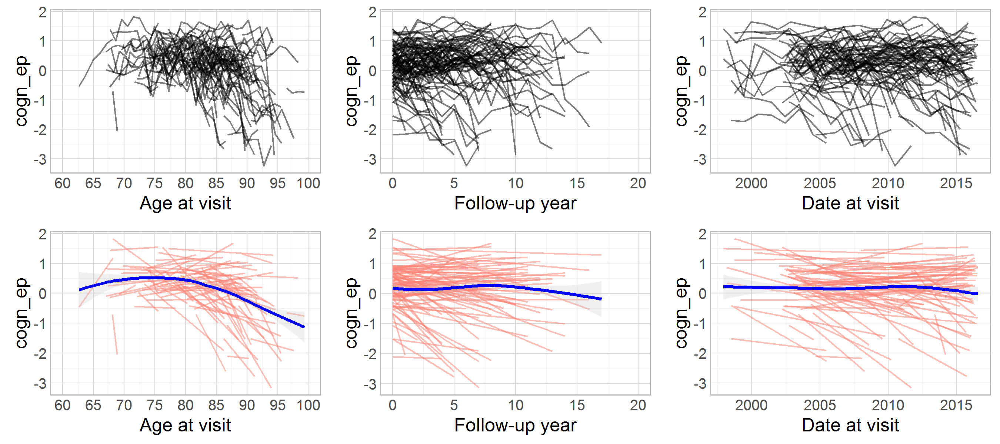
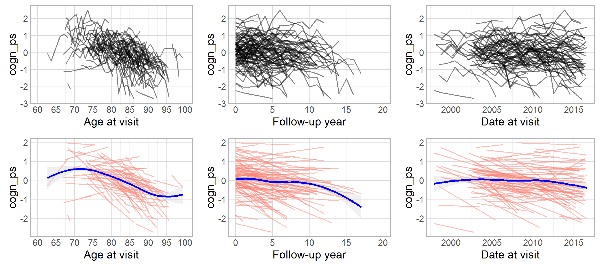

# MAP: initial variable review

<!-- These two chunks should be added in the beginning of every .Rmd that you want to source an .R script -->
<!--  The 1st mandatory chunck  -->
<!--  Set the working directory to the repository's base directory -->


<!--  The 2nd mandatory chunck  -->
<!-- Set the report-wide options, and point to the external code file. -->


<!-- Load 'sourced' R files.  Suppress the output when loading packages. --> 


<!-- Load the sources.  Suppress the output when loading sources. --> 


<!-- Load any Global functions and variables declared in the R file.  Suppress the output. --> 


<!-- Declare any global functions specific to a Rmd output.  Suppress the output. --> 


# (I) Exposition

> This report is a record of interaction with a data transfer object (dto) produced by `./manipulation/map/0-ellis-island-map.R`. 

The next section recaps this script, exposes the architecture of the DTO, and demonstrates the language of interacting with it.   

## (I.A) Ellis Island

> All data land on Ellis Island.

The script `0-ellis-island.R` is the first script in the analytic workflow. It accomplished the following: 

- (1) Reads in raw data file
- (2) Extract, combines, and exports metadata (specifically, variable names and labels, if provided) into `./data/shared/meta/map/names-labels-live.csv`, which is updated every time Ellis Island script is executed.   
- (3) Augments raw metadata with instructions for renaming and classifying variables. The instructions are provided as manually entered values in `./data/shared/meta/map/meta-data-map.csv`. They are used by automatic scripts in later manipulation and analysis.  
- (4) Combines unit and meta data into a single DTO to serve as a starting point to all subsequent analyses.   


<!-- Load the datasets.   -->

```r
# load the product of 0-ellis-island.R,  a list object containing data and metadata
# data_path_input  <- "../MAP/data-unshared/derived/ds0.rds" # original 
dto <- readRDS("./data-unshared/derived/dto.rds") # local copy
# each element this list is another list:
names(dto)
```

```
[1] "unitData" "metaData"
```

```r
# 3rd element - data set with unit data. Inspect the names of variables:
names(dto[["unitData"]])
```

```
  [1] "id"                    "study"                 "scaled_to"             "agreeableness"        
  [5] "conscientiousness"     "neo_altruism"          "neo_conscientiousness" "neo_trust"            
  [9] "neuroticism_12"        "openness"              "anxiety_10items"       "neuroticism_6"        
 [13] "cogdx"                 "age_bl"                "age_death"             "educ"                 
 [17] "msex"                  "race"                  "spanish"               "apoe_genotype"        
 [21] "alcohol_g_bl"          "alco_life"             "q3smo_bl"              "q4smo_bl"             
 [25] "smoking"               "cogact_chd"            "cogact_midage"         "cogact_past"          
 [29] "cogact_young"          "lostcons_ever"         "ad_reagan"             "braaksc"              
 [33] "ceradsc"               "niareagansc"           "income_40"             "fu_year"              
 [37] "scaled_to.y"           "cesdsum"               "r_depres"              "intrusion"            
 [41] "neglifeevents"         "negsocexchange"        "nohelp"                "panas"                
 [45] "perceivedstress"       "rejection"             "unsympathetic"         "dcfdx"                
 [49] "dementia"              "r_stroke"              "cogn_ep"               "cogn_po"              
 [53] "cogn_ps"               "cogn_se"               "cogn_wo"               "cogn_global"          
 [57] "cts_animals"           "cts_bname"             "catfluency"            "cts_db"               
 [61] "cts_delay"             "cts_df"                "cts_doperf"            "cts_ebdr"             
 [65] "cts_ebmt"              "cts_fruits"            "cts_idea"              "cts_lopair"           
 [69] "mmse"                  "cts_nccrtd"            "cts_pmat"              "cts_pmsub"            
 [73] "cts_read_nart"         "cts_read_wrat"         "cts_sdmt"              "cts_story"            
 [77] "cts_stroop_cname"      "cts_stroop_wread"      "cts_wli"               "cts_wlii"             
 [81] "cts_wliii"             "age_at_visit"          "iadlsum"               "katzsum"              
 [85] "rosbscl"               "rosbsum"               "vision"                "visionlog"            
 [89] "bun"                   "ca"                    "cholesterol"           "cloride"              
 [93] "co2"                   "crn"                   "fasting"               "glucose"              
 [97] "hba1c"                 "hdlchlstrl"            "hdlratio"              "k"                    
[101] "ldlchlstrl"            "na"                    "cogact_old"            "bmi"                  
[105] "htm"                   "phys5itemsum"          "wtkg"                  "socact_old"           
[109] "soc_net"               "social_isolation"      "bp_sit_1"              "bp_sit_2"             
[113] "bp_meds"               "bp_stand_3"            "hypertension_cum"      "cancer_cum"           
[117] "dm_cum"                "headinjrloc_cum"       "thyroid_cum"           "chf_cum"              
[121] "claudication_cum"      "heart_cum"             "stroke_cum"            "vasc_3dis_sum"        
[125] "vasc_4dis_sum"         "vasc_risks_sum"        "gait_speed"            "gripavg"              
[129] "total_smell_test"      "fev"                   "mep"                   "mip"                  
[133] "pvc"                   "firstobs"              "month"                 "year"                 
[137] "date_at_bl"            "age_at_bl"             "birth_date"            "birth_year"           
[141] "date_at_visit"         "died"                 
```

```r
# 4th element - dataset with augmented names and labels of the unit data
knitr::kable(head(dto[["metaData"]]))
```


name            label                                       type          name_new        construct   self_reported   longitudinal   unit       include   url                                                                                                                                notes 
--------------  ------------------------------------------  ------------  --------------  ----------  --------------  -------------  ---------  --------  ---------------------------------------------------------------------------------------------------------------------------------  ------
ad_reagan       Dicotomized NIA-Reagan score                pathology     ad_reagan       alzheimer   FALSE           FALSE          category   NA        https://www.radc.rush.edu/docs/var/detail.htm?category=Pathology&subcategory=Alzheimer%27s%20Disease&variable=niareagansc          NA    
age_at_visit    Age at cycle - fractional                   demographic   age_at_visit    age         FALSE           TRUE           year       TRUE      https://www.radc.rush.edu/docs/var/detail.htm?category=Demographics&variable=age_at_visit                                          NA    
age_bl          Age at baseline                             demographic   age_bl          age         FALSE           FALSE          year       TRUE      https://www.radc.rush.edu/docs/var/detail.htm?category=Demographics&variable=age_bl                                                NA    
age_death       Age at death                                demographic   age_death       age         FALSE           FALSE          year       TRUE      https://www.radc.rush.edu/docs/var/detail.htm?category=Demographics&variable=age_death                                             NA    
agreeableness   NEO agreeableness-ROS                       personality   agreeableness   NA          TRUE            FALSE          scale      NA        NA                                                                                                                                 NA    
alcohol_g_bl    Grams of alcohol used per day at baseline   substance     alcohol_g_bl    alcohol     TRUE            FALSE          grams      TRUE      https://www.radc.rush.edu/docs/var/detail.htm?category=Lifestyle&subcategory=Alcohol%20and%20Tobacco%20Use&variable=alcohol_g_bl   NA    

```r
# assing aliases
ds0 <- dto[["unitData"]]
ds <- ds0 # to leave a clean copy of the ds, before any manipulation takes place
```

### Meta

```r
dto[["metaData"]] %>%  
  dplyr::select(-url,-notes) %>% 
  DT::datatable(
    class   = 'cell-border stripe',
    caption = "This is a dynamic table of the metadata file. Edit at `./data/meta/map/meta-data-map.csv",
    filter  = "top",
    options = list(pageLength = 6, autoWidth = TRUE)
  )
```

<!--html_preserve--><div id="htmlwidget-160596a48f0904ea7f52" style="width:100%;height:auto;" class="datatables html-widget"></div>
<script type="application/json" data-for="htmlwidget-160596a48f0904ea7f52">{"x":{"filter":"top","filterHTML":"<tr>\n  <td>\u003c/td>\n  <td data-type=\"character\" style=\"vertical-align: top;\">\n    <div class=\"form-group has-feedback\" style=\"margin-bottom: auto;\">\n      <input type=\"search\" placeholder=\"All\" class=\"form-control\" style=\"width: 100%;\"/>\n      <span class=\"glyphicon glyphicon-remove-circle form-control-feedback\">\u003c/span>\n    \u003c/div>\n  \u003c/td>\n  <td data-type=\"character\" style=\"vertical-align: top;\">\n    <div class=\"form-group has-feedback\" style=\"margin-bottom: auto;\">\n      <input type=\"search\" placeholder=\"All\" class=\"form-control\" style=\"width: 100%;\"/>\n      <span class=\"glyphicon glyphicon-remove-circle form-control-feedback\">\u003c/span>\n    \u003c/div>\n  \u003c/td>\n  <td data-type=\"character\" style=\"vertical-align: top;\">\n    <div class=\"form-group has-feedback\" style=\"margin-bottom: auto;\">\n      <input type=\"search\" placeholder=\"All\" class=\"form-control\" style=\"width: 100%;\"/>\n      <span class=\"glyphicon glyphicon-remove-circle form-control-feedback\">\u003c/span>\n    \u003c/div>\n  \u003c/td>\n  <td data-type=\"character\" style=\"vertical-align: top;\">\n    <div class=\"form-group has-feedback\" style=\"margin-bottom: auto;\">\n      <input type=\"search\" placeholder=\"All\" class=\"form-control\" style=\"width: 100%;\"/>\n      <span class=\"glyphicon glyphicon-remove-circle form-control-feedback\">\u003c/span>\n    \u003c/div>\n  \u003c/td>\n  <td data-type=\"character\" style=\"vertical-align: top;\">\n    <div class=\"form-group has-feedback\" style=\"margin-bottom: auto;\">\n      <input type=\"search\" placeholder=\"All\" class=\"form-control\" style=\"width: 100%;\"/>\n      <span class=\"glyphicon glyphicon-remove-circle form-control-feedback\">\u003c/span>\n    \u003c/div>\n  \u003c/td>\n  <td data-type=\"logical\" style=\"vertical-align: top;\">\n    <div class=\"form-group has-feedback\" style=\"margin-bottom: auto;\">\n      <input type=\"search\" placeholder=\"All\" class=\"form-control\" style=\"width: 100%;\"/>\n      <span class=\"glyphicon glyphicon-remove-circle form-control-feedback\">\u003c/span>\n    \u003c/div>\n    <div style=\"width: 100%; display: none;\">\n      <select multiple=\"multiple\" style=\"width: 100%;\" data-options=\"[&quot;true&quot;,&quot;false&quot;,&quot;na&quot;]\">\u003c/select>\n    \u003c/div>\n  \u003c/td>\n  <td data-type=\"logical\" style=\"vertical-align: top;\">\n    <div class=\"form-group has-feedback\" style=\"margin-bottom: auto;\">\n      <input type=\"search\" placeholder=\"All\" class=\"form-control\" style=\"width: 100%;\"/>\n      <span class=\"glyphicon glyphicon-remove-circle form-control-feedback\">\u003c/span>\n    \u003c/div>\n    <div style=\"width: 100%; display: none;\">\n      <select multiple=\"multiple\" style=\"width: 100%;\" data-options=\"[&quot;true&quot;,&quot;false&quot;,&quot;na&quot;]\">\u003c/select>\n    \u003c/div>\n  \u003c/td>\n  <td data-type=\"character\" style=\"vertical-align: top;\">\n    <div class=\"form-group has-feedback\" style=\"margin-bottom: auto;\">\n      <input type=\"search\" placeholder=\"All\" class=\"form-control\" style=\"width: 100%;\"/>\n      <span class=\"glyphicon glyphicon-remove-circle form-control-feedback\">\u003c/span>\n    \u003c/div>\n  \u003c/td>\n  <td data-type=\"logical\" style=\"vertical-align: top;\">\n    <div class=\"form-group has-feedback\" style=\"margin-bottom: auto;\">\n      <input type=\"search\" placeholder=\"All\" class=\"form-control\" style=\"width: 100%;\"/>\n      <span class=\"glyphicon glyphicon-remove-circle form-control-feedback\">\u003c/span>\n    \u003c/div>\n    <div style=\"width: 100%; display: none;\">\n      <select multiple=\"multiple\" style=\"width: 100%;\" data-options=\"[&quot;true&quot;,&quot;false&quot;,&quot;na&quot;]\">\u003c/select>\n    \u003c/div>\n  \u003c/td>\n\u003c/tr>","caption":"<caption>This is a dynamic table of the metadata file. Edit at `./data/meta/map/meta-data-map.csv\u003c/caption>","data":[["1","2","3","4","5","6","7","8","9","10","11","12","13","14","15","16","17","18","19","20","21","22","23","24","25","26","27","28","29","30","31","32","33","34","35","36","37","38","39","40","41","42","43","44","45","46","47","48","49","50","51","52","53","54","55","56","57","58","59","60","61","62","63","64","65","66","67","68","69","70","71","72","73","74","75","76","77","78","79","80","81","82","83","84","85","86","87","88","89","90","91","92","93","94","95","96","97","98","99","100","101","102","103","104","105","106","107","108","109","110","111","112","113","114","115","116","117","118","119","120","121","122","123","124","125","126","127","128","129","130","131","132","133","134"],["ad_reagan","age_at_visit","age_bl","age_death","agreeableness","alcohol_g_bl","anxiety_10items","apoe_genotype","bmi","bp11","bp2","bp3","bp31","braaksc","bun","ca","cancer_cum","ceradsc","cesdsum","chd_cogact_freq","chf_cum","chlstrl","cl","claudication_cum","co2","cogdate","cogdx","cogn_ep","cogn_global","cogn_po","cogn_ps","cogn_se","cogn_wo","conscientiousness","crn","cts_animals","cts_bname","cts_catflu","cts_db","cts_delay","cts_df","cts_doperf","cts_ebdr","cts_ebmt","cts_fruits","cts_idea","cts_lopair","cts_mmse30","cts_nccrtd","cts_pmat","cts_pmsub","cts_read_nart","cts_read_wrat","cts_sdmt","cts_story","cts_stroop_cname","cts_stroop_wread","cts_wli","cts_wlii","cts_wliii","dcfdx","dementia","dm_cum","educ","fasting","fev","fu_year","gait_speed","glucose","gripavg","hba1c","hdlchlstrl","hdlratio","headinjrloc_cum","heart_cum","htm","hypertension_cum","iadlsum","intrusion","k","katzsum","late_life_cogact_freq","late_life_soc_act","ldai_bl","ldlchlstrl","lostcons_ever","ma_adult_cogact_freq","mep","mip","msex","na","neglifeevents","negsocexchange","neo_altruism","neo_conscientiousness","neo_trust","neuroticism_12","neuroticism_6","niareagansc","nohelp","openness","panas","past_cogact_freq","perceivedstress","phys5itemsum","projid","pvc","q3smo_bl","q40inc","q4smo_bl","r_depres","r_stroke","race","rejection","rosbscl","rosbsum","scaled_to.x","scaled_to.y","smoking","soc_net","social_isolation","spanish","stroke_cum","study","thyroid_cum","total_smell_test","unsympathetic","vasc_3dis_sum","vasc_4dis_sum","vasc_risks_sum","vision","visionlog","wtkg","ya_adult_cogact_freq"],["Dicotomized NIA-Reagan score","Age at cycle - fractional","Age at baseline","Age at death","NEO agreeableness-ROS","Grams of alcohol used per day at baseline","Anxiety-10 item version - ROS and MAP","Apolipoprotein E genotype","Body mass index","Blood pressure measurement- sitting - trial 1","Blood pressure measurement- sitting - trial 2","Hx of Meds for HTN","Blood pressure measurement- standing","Semiquantitative measure of neurofibrillary tangles","Blood urea nitrogen","Calcium","Medical Conditions - cancer - cumulative","Semiquantitative measure of neuritic plaques","Measure of depressive symptoms (Modified CESD)","Cognitive actifity - child","Medical Conditions - congestive heart failure -cumulative","Cholesterol","Chloride","Medical conditions - claudication -cumulative","Carbon Dioxide","Date of the interview at baseline","Final consensus cognitive diagnosis","Calculated domain score-episodic memory","Global cognitive score","Calculated domain score - perceptual orientation","Calculated domain score - perceptual speed","Calculated domain score - semantic memory","Calculated domain score - working memory","Conscientiousness-ROS/MAP","Creatinine","Category fluence - Animals","Boston naming - 2014","Category fluency - 2014","Digits backwards - 2014","Logical memory IIa - 2014","Digits forwards - 2014","Digit ordering - 2014","East Boston story - delayed recall - 2014","East Boston story - immediate - 2014","Category fluency - Fruits","Complex ideas - 2014","Line orientation - 2014","MMSE - 2014","Number comparison - 2014","Progressive Matrices - 2014",null,"Reading test-NART-2014","Reading test - WRAT - 2014","Symbol digit modalitities - 2014","Logical memory Ia - immediate - 2014",null,null,"Word list I- immediate- 2014","Word list II - delayed - 2014","Word list III - recognition - 2014","Clinical dx summary","Dementia diagnosis","Medical history - diabetes - cumulative","Years of education","Whether blood was collected on fasting participant","forced expiratory volume","Follow-up year","Gait Speed - MAP","Glucose","Extremity strength","Hemoglobin A1c","HDL cholesterol","HDL ratio",null,"Medical Conditions - heart - cumulative","Height(meters)","Medical conditions - hypertension - cumulative","Instrumental activities of daily liviing","Negative social exchange-intrusion-MAP","Potassium","Katz measure of disability","Codnitive activity - late life","Social activity - late life","Lifetime daily alcohol intake -baseline","LDL cholesterol",null,"Codnitive activity - middle age","maximal expiratory pressure","maximal inspiratory pressure","Gender","Sodium","Negative life events","Negative social exchange","NEO altruism scale-MAP","NEO conscientiousness-MAP","NEO trust-MAP","Neuroticism - 12 item version-RMM","Neuroticism - 6 item version - RMM",null,"Negative social exchange-help-MAP","NEO openess-ROS","Panas score","Cognitive actifity - past","Perceived stress","Physical activity (summary of 5 items)","Subject identifier","pulmonary vital capacity","Smoking quantity-baseline","Income level at age 40","Smoking duration-baseline","Major depression dx-clinic rating","Clinical stroke dx","Participant's race","Negative social exchange - rejection-MAP","Rosow-Breslau scale","Rosow-Breslau scale","Scaled parameter","Scaled parameter","Smoking","Social network size","Percieved social isolation","Spanish/Hispanic origin","Clinical Diagnoses - Stroke - cumulative","The particular RADC study (MAP/ROS/RMM)","Medical Conditions - thyroid disease - cumulative",null,"Negative social exchange-unsymapathetic-MAP","Vascular disease burden (3 items w/o chf)\r\r ROS/MAP/MARS","Vascular disease burden (4 items) - MAP/MARS\r\r only","Vascular disease risk factors","Vision acuity","Visual acuity","Weight (kg)","Cognitive actifity - young adult"],["pathology","demographic","demographic","demographic","personality","substance","personality","clinical","physical","medical","medical","medical","medical","pathology","clinical","clinical",null,"pathology","psychological","cognitive","clinical","clinical","clinical","clinical","clinical","design","clinical","cognitive","cognitive","cognitive","cognitive","cognitive","cognitive","personality","clinical","cognitive","cognitive","cognitive","cognitive","cognitive","cognitive","cognitive","cognitive","cognitive","cognitive","cognitive","cognitive","cognitive","cognitive","cognitive","cognitive","cognitive","cognitive","cognitive","cognitive","cognitive","cognitive","cognitive","cognitive","cognitive","clinical","cognitive","clinical","demographic","clinical","physical","design","physical","clinical","physical","clinical","clinical","clinical",null,"clinical","physical","clinical","physical","psychological","clinical","physical","lifestyle","lifestyle","substance","clinical",null,"cognitive","physical","physical","demographic","clinical","psychological","psychological","personality","personality","personality","personality","personality",null,"psychological","personality","psychological","cognitive","psychological","physical","design","physical","substance","demographic","substance","psychological","clinical","demographic","psychological","physical","physical","design","design","substance","lifestyle","lifestyle","demographic","clinical","design","clinical",null,"psychological","clinical","clinical","clinical","physical","physical","physical",null],["ad_reagan","age_at_visit","age_bl","age_death","agreeableness","alcohol_g_bl","anxiety_10items","apoe_genotype","bmi","bp_sit_1","bp_sit_2","bp_meds","bp_stand_3","braaksc","bun","ca","cancer_cum","ceradsc","cesdsum","cogact_chd","chf_cum","cholesterol","cloride","claudication_cum","co2","date_at_baseline","cogdx","cogn_ep","cogn_global","cogn_po","cogn_ps","cogn_se","cogn_wo","conscientiousness","crn","cts_animals","cts_bname","catfluency","cts_db","cts_delay","cts_df","cts_doperf","cts_ebdr","cts_ebmt","cts_fruits","cts_idea","cts_lopair","mmse","cts_nccrtd","cts_pmat","cts_pmsub","cts_read_nart","cts_read_wrat","cts_sdmt","cts_story","cts_stroop_cname","cts_stroop_wread","cts_wli","cts_wlii","cts_wliii","dcfdx","dementia","dm_cum","educ","fasting","fev","fu_year","gait_speed","glucose","gripavg","hba1c","hdlchlstrl","hdlratio","headinjrloc_cum","heart_cum","htm","hypertension_cum","iadlsum","intrusion","k","katzsum","cogact_old","socact_old","alco_life","ldlchlstrl","lostcons_ever","cogact_midage","mep","mip","msex","na","neglifeevents","negsocexchange","neo_altruism","neo_conscientiousness","neo_trust","neuroticism_12","neuroticism_6","niareagansc","nohelp","openness","panas","cogact_past","perceivedstress","phys5itemsum","id","pvc","q3smo_bl","income_40","q4smo_bl","r_depres","r_stroke","race","rejection","rosbscl","rosbsum","scaled_to","scaled_to.y","smoking","soc_net","social_isolation","spanish","stroke_cum","study","thyroid_cum","total_smell_test","unsympathetic","vasc_3dis_sum","vasc_4dis_sum","vasc_risks_sum","vision","visionlog","wtkg","cogact_young"],["alzheimer","age","age","age",null,"alcohol","anxiety","apoe","physique","hypertension","hypertension","hypertension","hypertension","Braak",null,null,"cancer","CERAD","depression",null,"cardio","cholesterol","cloride",null,null,null,null,"episodic memory","global cognition","perceptual orientation","perceptual speed","semantic memory","working memory","conscientiousness",null,null,"semantic memory","semantic memory","working memory","episodic memory","working memory","working memory","episodic memory","episodic memory",null,"verbal comprehension","perceptual orientation","dementia","perceptual speed","perceptual orientation",null,"semantic memory","semantic memory","perceptual speed","episodic memory",null,null,"episodic memory","episodic memory","episodic memory","cognition","dementia","diabetes","education",null,"physcap","time","physcap",null,"physcap",null,null,null,null,null,"physique","hypertension","physact",null,null,"physcap",null,null,"alcohol",null,null,null,"physcap","physcap","sex",null,null,null,null,null,null,null,null,null,null,null,null,null,null,"physact",null,"physcap","smoking",null,"smoking",null,"stroke","race",null,"physcap","physcap",null,null,"smoking",null,null,"race","stroke",null,null,null,null,null,null,null,"physcap","physcap","physique",null],[false,false,false,false,true,true,null,false,false,false,false,true,false,false,false,false,false,false,true,null,true,false,false,false,false,false,false,false,false,false,false,false,false,true,null,null,false,false,false,false,false,false,false,false,null,false,false,true,false,false,null,false,false,false,false,null,null,false,false,false,false,false,true,true,null,false,false,false,null,false,null,null,null,null,null,false,true,true,null,null,true,true,true,true,null,null,null,false,false,false,null,null,null,null,null,null,null,null,null,null,null,null,null,null,true,null,false,true,null,true,null,false,true,null,true,true,null,null,true,null,null,true,false,null,null,null,null,null,null,null,false,false,false,null],[false,true,false,false,false,false,false,false,true,true,true,true,true,false,true,true,false,false,true,null,true,true,true,false,true,false,false,true,true,true,true,true,true,false,null,null,true,true,true,true,true,true,true,true,null,true,true,true,true,true,null,true,true,true,true,null,null,true,true,true,true,true,true,false,null,true,true,true,null,true,null,null,null,null,null,true,true,true,null,null,true,true,true,false,null,null,null,true,true,false,null,null,null,null,null,null,null,null,null,null,null,null,null,null,true,null,true,false,null,false,null,true,false,null,true,true,null,null,false,null,null,false,true,null,null,null,null,null,null,null,true,true,true,null],["category","year","year","year","scale","grams","scale","category","kg/msq","scale","scale","category","scale","category","scale","scale","category","category","scale",null,"category","scale","scale","category","scale",null,"category","composite","composite","composite","composite","composite","composite","composite",null,null,"0 to 15","0 to 75","0 to 12","0 to 25","0 to 12","0 to 14","0 to 12","0 to 12",null,"0 to 8","0 to 15","0 to 30","0 to 48","0 to 16",null,"0 to 10","0 to 15","0 to 110","0 to 25",null,null,"0 to 30","0 to 10","o to 10","category","0, 1",null,"years",null,"liters","time point","min/sec",null,"lbs",null,null,null,null,null,"meters",null,"scale",null,null,"scale","category","category","drinks/day",null,null,null,"cm H20","cm H20","category",null,null,null,null,null,null,null,null,null,null,null,null,null,null,"hours",null,"liters","cigarettes / day",null,"years",null,"category","category",null,"scale","scale",null,null,"category",null,null,"category","category",null,null,null,null,null,null,null,"scale","scale","kilos",null],[null,true,true,true,null,true,null,true,true,null,null,null,null,null,null,null,null,null,true,true,true,null,null,null,null,true,true,true,true,true,true,true,true,null,null,null,null,null,null,null,null,null,null,null,null,null,null,true,null,null,null,null,null,null,null,null,null,null,null,null,true,true,null,true,null,true,true,true,null,true,null,null,null,null,null,true,null,true,null,null,true,true,true,true,null,null,true,true,true,true,null,null,true,null,null,null,null,null,null,null,null,null,true,null,true,true,true,true,true,true,null,true,true,true,true,true,null,null,true,true,true,null,null,null,null,null,null,null,null,null,null,null,true,true]],"container":"<table class=\"cell-border stripe\">\n  <thead>\n    <tr>\n      <th> \u003c/th>\n      <th>name\u003c/th>\n      <th>label\u003c/th>\n      <th>type\u003c/th>\n      <th>name_new\u003c/th>\n      <th>construct\u003c/th>\n      <th>self_reported\u003c/th>\n      <th>longitudinal\u003c/th>\n      <th>unit\u003c/th>\n      <th>include\u003c/th>\n    \u003c/tr>\n  \u003c/thead>\n\u003c/table>","options":{"pageLength":6,"autoWidth":true,"order":[],"orderClasses":false,"columnDefs":[{"orderable":false,"targets":0}],"orderCellsTop":true,"lengthMenu":[6,10,25,50,100]}},"evals":[],"jsHooks":[]}</script><!--/html_preserve-->


<!-- Inspect the datasets.   -->


<!-- Tweak the datasets.   -->


<!-- Basic table view.   -->


<!-- Basic graph view.   -->


# (II) Development

Details  were requested about the following items (including the availability of treatment for each) :

1. N at each wave
2. Cognitive capability measures
3. Dementia diagnosis
4. Education
5. Social class
6. Physique
7. Smoking  habits
8. Alcohol consumption
9. Social engagement
10. Physical activitiy
11. APOE status
12. Physical capability measures 
13. Cardiovascular disease
14. Hypertension
15. Stroke
16. Diabetes

### General comments

for **all variables** conditions, declare whether they are   
- self reported or diagnosed   
- time variant or invariant (study entry only)   
- treatment or management of the conditions is available  
- provide levels and labels for items with categorical responses   
- specific description of measurement encoding   

## (1) N at each wave

The following pattern of attrition has been observed in the data

```r
dto[["metaData"]] %>% dplyr::filter(name=="fu_year")
```

```
# A tibble: 1 × 11
     name          label   type name_new construct self_reported longitudinal       unit include   url notes
    <chr>          <chr>  <chr>    <chr>     <chr>         <lgl>        <lgl>      <chr>   <lgl> <chr> <chr>
1 fu_year Follow-up year design  fu_year      time         FALSE         TRUE time point    TRUE  <NA>  <NA>
```

```r
ds %>% 
  dplyr::group_by_("fu_year") %>%
  dplyr::summarize(sample_size=n())
```

```
# A tibble: 20 × 2
   fu_year sample_size
     <int>       <int>
1        0        1852
2        1        1613
3        2        1438
4        3        1264
5        4        1095
6        5         908
7        6         787
8        7         644
9        8         524
10       9         439
11      10         348
12      11         290
13      12         200
14      13         130
15      14          52
16      15          33
17      16          19
18      17          17
19      18          19
20      NA           1
```


## (2) Cognitive capability measures
The following measures of cognitive capability are available in the present instance of MAP data:


```r
knitr::kable(dto[["metaData"]] %>% 
  dplyr::filter(type=="cognitive") %>% 
  dplyr::select(-name,-type,-name_new, -include) %>%
  dplyr::arrange(construct))
```


label                                              construct                self_reported   longitudinal   unit        url                                                                                                                               notes        
-------------------------------------------------  -----------------------  --------------  -------------  ----------  --------------------------------------------------------------------------------------------------------------------------------  -------------
MMSE - 2014                                        dementia                 TRUE            TRUE           0 to 30     NA                                                                                                                                NA           
Dementia diagnosis                                 dementia                 FALSE           TRUE           0, 1        NA                                                                                                                                NA           
Calculated domain score-episodic memory            episodic memory          FALSE           TRUE           composite   https://www.radc.rush.edu/docs/var/detail.htm?category=Cognition&subcategory=Domains&variable=cogn_ep                             NA           
Logical memory IIa - 2014                          episodic memory          FALSE           TRUE           0 to 25     NA                                                                                                                                NA           
East Boston story - delayed recall - 2014          episodic memory          FALSE           TRUE           0 to 12     NA                                                                                                                                NA           
East Boston story - immediate - 2014               episodic memory          FALSE           TRUE           0 to 12     NA                                                                                                                                NA           
Logical memory Ia - immediate - 2014               episodic memory          FALSE           TRUE           0 to 25     NA                                                                                                                                NA           
Word list I- immediate- 2014                       episodic memory          FALSE           TRUE           0 to 30     NA                                                                                                                                NA           
Word list II - delayed - 2014                      episodic memory          FALSE           TRUE           0 to 10     NA                                                                                                                                NA           
Word list III - recognition - 2014                 episodic memory          FALSE           TRUE           o to 10     NA                                                                                                                                NA           
Global cognitive score                             global cognition         FALSE           TRUE           composite   https://www.radc.rush.edu/docs/var/detail.htm?category=Cognition&subcategory=Global%20cognition&variable=cogn_global              NA           
Calculated domain score - perceptual orientation   perceptual orientation   FALSE           TRUE           composite   https://www.radc.rush.edu/docs/var/detail.htm?category=Cognition&subcategory=Domains&variable=cogn_po                             NA           
Line orientation - 2014                            perceptual orientation   FALSE           TRUE           0 to 15     NA                                                                                                                                NA           
Progressive Matrices - 2014                        perceptual orientation   FALSE           TRUE           0 to 16     NA                                                                                                                                NA           
Calculated domain score - perceptual speed         perceptual speed         FALSE           TRUE           composite   https://www.radc.rush.edu/docs/var/detail.htm?category=Cognition&subcategory=Domains&variable=cogn_ps                             NA           
Number comparison - 2014                           perceptual speed         FALSE           TRUE           0 to 48     NA                                                                                                                                NA           
Symbol digit modalitities - 2014                   perceptual speed         FALSE           TRUE           0 to 110    NA                                                                                                                                NA           
Calculated domain score - semantic memory          semantic memory          FALSE           TRUE           composite   https://www.radc.rush.edu/docs/var/detail.htm?category=Cognition&subcategory=Domains&variable=cogn_se                             NA           
Boston naming - 2014                               semantic memory          FALSE           TRUE           0 to 15     NA                                                                                                                                NA           
Category fluency - 2014                            semantic memory          FALSE           TRUE           0 to 75     NA                                                                                                                                NA           
Reading test-NART-2014                             semantic memory          FALSE           TRUE           0 to 10     NA                                                                                                                                NA           
Reading test - WRAT - 2014                         semantic memory          FALSE           TRUE           0 to 15     NA                                                                                                                                NA           
Complex ideas - 2014                               verbal comprehension     FALSE           TRUE           0 to 8      NA                                                                                                                                NA           
Calculated domain score - working memory           working memory           FALSE           TRUE           composite   https://www.radc.rush.edu/docs/var/detail.htm?category=Cognition&subcategory=Domains&variable=cogn_wo                             NA           
Digits backwards - 2014                            working memory           FALSE           TRUE           0 to 12     NA                                                                                                                                NA           
Digits forwards - 2014                             working memory           FALSE           TRUE           0 to 12     NA                                                                                                                                NA           
Digit ordering - 2014                              working memory           FALSE           TRUE           0 to 14     NA                                                                                                                                NA           
Cognitive actifity - child                         NA                       NA              NA             NA          todo                                                                                                                              young adult? 
Category fluence - Animals                         NA                       NA              NA             NA          NA                                                                                                                                NA           
Category fluency - Fruits                          NA                       NA              NA             NA          NA                                                                                                                                NA           
NA                                                 NA                       NA              NA             NA          NA                                                                                                                                NA           
NA                                                 NA                       NA              NA             NA          NA                                                                                                                                NA           
NA                                                 NA                       NA              NA             NA          NA                                                                                                                                NA           
Codnitive activity - middle age                    NA                       NA              NA             NA          https://www.radc.rush.edu/docs/var/detail.htm?category=Lifestyle&subcategory=Cognitive%20Activity&variable=ma_adult_cogact_freq   NA           
Cognitive actifity - past                          NA                       NA              NA             NA          todo                                                                                                                              NA           

\n\n

Keep for modelling only composite score of cognitive  domains


```r
knitr::kable(dto[["metaData"]] %>% 
  dplyr::filter(type=="cognitive", include==TRUE) %>% 
  dplyr::select(-type,-name_new, - include) %>%
  dplyr::arrange(construct))
```


name                   label                                              construct                self_reported   longitudinal   unit        url                                                                                                                               notes        
---------------------  -------------------------------------------------  -----------------------  --------------  -------------  ----------  --------------------------------------------------------------------------------------------------------------------------------  -------------
cts_mmse30             MMSE - 2014                                        dementia                 TRUE            TRUE           0 to 30     NA                                                                                                                                NA           
dementia               Dementia diagnosis                                 dementia                 FALSE           TRUE           0, 1        NA                                                                                                                                NA           
cogn_ep                Calculated domain score-episodic memory            episodic memory          FALSE           TRUE           composite   https://www.radc.rush.edu/docs/var/detail.htm?category=Cognition&subcategory=Domains&variable=cogn_ep                             NA           
cogn_global            Global cognitive score                             global cognition         FALSE           TRUE           composite   https://www.radc.rush.edu/docs/var/detail.htm?category=Cognition&subcategory=Global%20cognition&variable=cogn_global              NA           
cogn_po                Calculated domain score - perceptual orientation   perceptual orientation   FALSE           TRUE           composite   https://www.radc.rush.edu/docs/var/detail.htm?category=Cognition&subcategory=Domains&variable=cogn_po                             NA           
cogn_ps                Calculated domain score - perceptual speed         perceptual speed         FALSE           TRUE           composite   https://www.radc.rush.edu/docs/var/detail.htm?category=Cognition&subcategory=Domains&variable=cogn_ps                             NA           
cogn_se                Calculated domain score - semantic memory          semantic memory          FALSE           TRUE           composite   https://www.radc.rush.edu/docs/var/detail.htm?category=Cognition&subcategory=Domains&variable=cogn_se                             NA           
cogn_wo                Calculated domain score - working memory           working memory           FALSE           TRUE           composite   https://www.radc.rush.edu/docs/var/detail.htm?category=Cognition&subcategory=Domains&variable=cogn_wo                             NA           
chd_cogact_freq        Cognitive actifity - child                         NA                       NA              NA             NA          todo                                                                                                                              young adult? 
ma_adult_cogact_freq   Codnitive activity - middle age                    NA                       NA              NA             NA          https://www.radc.rush.edu/docs/var/detail.htm?category=Lifestyle&subcategory=Cognitive%20Activity&variable=ma_adult_cogact_freq   NA           
past_cogact_freq       Cognitive actifity - past                          NA                       NA              NA             NA          todo                                                                                                                              NA           


```r
dto[["unitData"]] %>% 
  dplyr::select(id,fu_year, cogn_global) %>% 
  dplyr::filter(!is.na(cogn_global)) %>%
  dplyr::group_by(fu_year) %>% 
  dplyr::summarize(average_global_cognition = round(mean(cogn_global),3),
                   sd = sprintf("%0.2f",sd(cogn_global)), 
                   observed =n()) 
```

In displays below, each cognitive measure is graphed across age (right) and time (left), examining observed trajectories (top row, black lines),  and their linear approximations (bottom row, red lines) with  loess curves (thik blue with ribbon). 
<!-- Individual graphs could be produced with the following script -->


### Global
Global cognitive score


### Semantic
 Calculated domain score - semantic memory


### Episodic 
 Calculated domain score - episodic memory


### Working 
 Calculated domain score - working memory


### Perceptual 
Calculated domain score - perceptual orientation


### Speed
 Calculated domain score - perceptual speed


### MMSE 
Mini mental state exam 


## (3) Dementia
 Dementia diagnosis

```
# A tibble: 1 × 11
      name              label      type name_new construct self_reported longitudinal  unit include   url notes
     <chr>              <chr>     <chr>    <chr>     <chr>         <lgl>        <lgl> <chr>   <lgl> <chr> <chr>
1 dementia Dementia diagnosis cognitive dementia  dementia         FALSE         TRUE  0, 1    TRUE  <NA>  <NA>
```

```
# A tibble: 19 × 3
   fu_year percent_diagnosed observed_n
     <int>             <dbl>      <int>
1        0        0.05402485       1851
2        1        0.06721623       1577
3        2        0.09567682       1411
4        3        0.10985460       1238
5        4        0.12298959       1057
6        5        0.13528749        887
7        6        0.13984169        758
8        7        0.17656501        623
9        8        0.18737673        507
10       9        0.17590361        415
11      10        0.17910448        335
12      11        0.20895522        268
13      12        0.21621622        185
14      13        0.24074074        108
15      14        0.25581395         43
16      15        0.26923077         26
17      16        0.36842105         19
18      17        0.33333333         15
19      18        0.40000000          5
```


```
# A tibble: 10 × 3
       age_cat percent_diagnosed observed_n
        <fctr>             <dbl>      <int>
1  (53.3,58.8]       0.000000000         32
2  (58.8,64.2]       0.007936508        126
3  (64.2,69.7]       0.021825397        504
4  (69.7,75.2]       0.037790698       1032
5  (75.2,80.6]       0.049713193       2092
6  (80.6,86.1]       0.087291795       3242
7  (86.1,91.5]       0.169130285       2909
8    (91.5,97]       0.262975779       1156
9     (97,102]       0.385650224        223
10   (102,108]       0.416666667         12
```


## (4) Education


```
# A tibble: 1 × 11
   name              label        type name_new construct self_reported longitudinal  unit include   url notes
  <chr>              <chr>       <chr>    <chr>     <chr>         <lgl>        <lgl> <chr>   <lgl> <chr> <chr>
1  educ Years of education demographic     educ education          TRUE        FALSE years    TRUE  <NA>  <NA>
```

```
# A tibble: 20 × 4
   fu_year average_years_edu       SD observed_n
     <int>             <dbl>    <dbl>      <int>
1        0          14.61135 3.283566       1850
2        1          14.72226 3.212063       1613
3        2          14.73713 3.193879       1438
4        3          14.74525 3.149982       1264
5        4          14.72785 3.117870       1095
6        5          14.72357 3.167436        908
7        6          14.64676 3.257756        787
8        7          14.75311 3.155322        644
9        8          14.79771 3.114316        524
10       9          14.77221 2.980615        439
11      10          14.81897 2.990665        348
12      11          14.92069 2.945395        290
13      12          14.88000 2.956230        200
14      13          15.00000 3.090370        130
15      14          15.40385 2.802377         52
16      15          14.93939 2.703463         33
17      16          15.31579 2.286497         19
18      17          15.29412 2.084607         17
19      18          14.26316 2.232142         19
20      NA          12.00000      NaN          1
```

## (5) Social class
No indicator of social class if found in our version of MAP data

## (6) BMI


```
# A tibble: 3 × 11
   name           label     type name_new construct self_reported longitudinal   unit include
  <chr>           <chr>    <chr>    <chr>     <chr>         <lgl>        <lgl>  <chr>   <lgl>
1   bmi Body mass index physical      bmi  physique         FALSE         TRUE kg/msq    TRUE
2   htm  Height(meters) physical      htm  physique         FALSE         TRUE meters    TRUE
3  wtkg     Weight (kg) physical     wtkg  physique         FALSE         TRUE  kilos    TRUE
# ... with 2 more variables: url <chr>, notes <chr>
```

```
# A tibble: 19 × 4
   fu_year average_bmi       SD observed_n
     <int>       <dbl>    <dbl>      <int>
1        0    27.27109 5.425121       1799
2        1    27.32047 5.303549       1523
3        2    27.22470 5.295299       1336
4        3    27.17220 5.344430       1148
5        4    27.10899 5.109127        962
6        5    27.09338 5.421648        780
7        6    26.61708 5.317700        629
8        7    26.82205 5.305770        520
9        8    26.83554 5.326082        391
10       9    26.90696 5.710673        346
11      10    27.22139 5.671200        268
12      11    27.18993 5.407083        228
13      12    26.60319 5.336092        152
14      13    27.06171 5.329555         88
15      14    26.89846 5.281620         40
16      15    26.30766 6.085734         20
17      16    28.43710 6.292571         14
18      17    25.51479 2.846066          9
19      18    26.79843 2.434091          6
```
