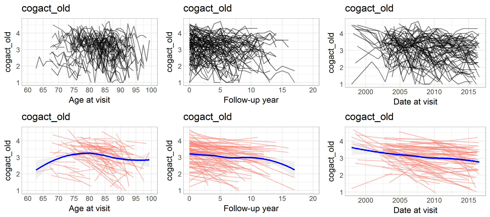
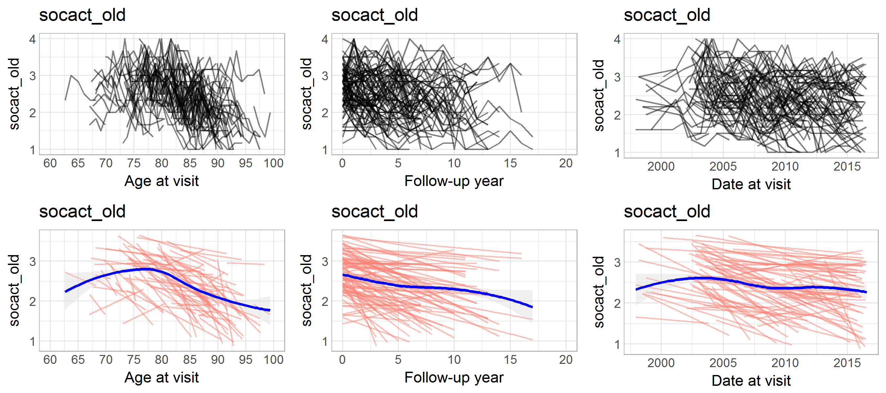
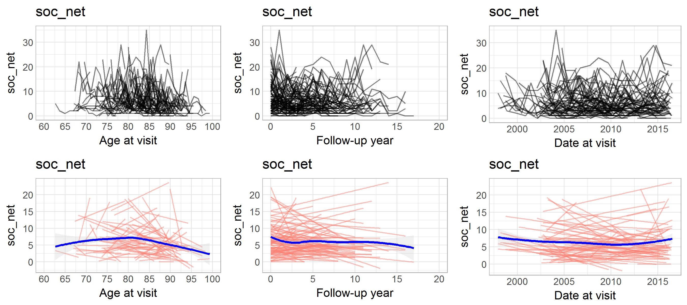
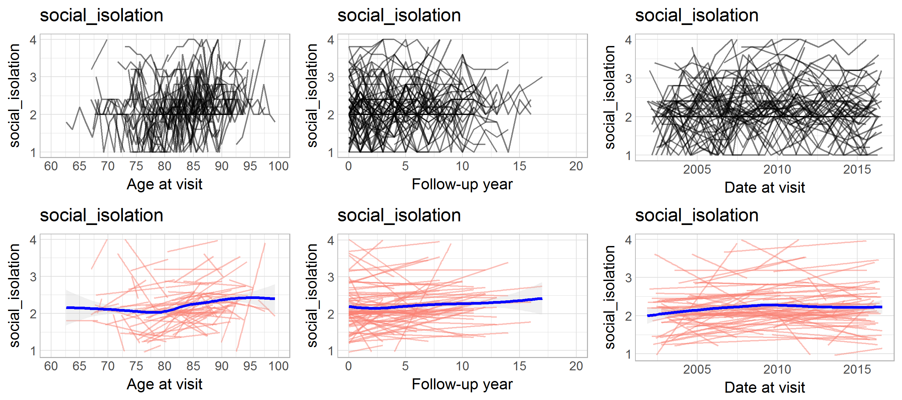

# MAP: initial variable review

<!-- These two chunks should be added in the beginning of every .Rmd that you want to source an .R script -->
<!--  The 1st mandatory chunck  -->
<!--  Set the working directory to the repository's base directory -->


<!--  The 2nd mandatory chunck  -->
<!-- Set the report-wide options, and point to the external code file. -->


<!-- Load 'sourced' R files.  Suppress the output when loading packages. --> 


<!-- Load the sources.  Suppress the output when loading sources. --> 


<!-- Load any Global functions and variables declared in the R file.  Suppress the output. --> 


<!-- Declare any global functions specific to a Rmd output.  Suppress the output. --> 


> This report is a record of interaction with a data transfer object (dto) produced by `./manipulation/map/0-ellis-island-map.R`. 


<!-- Load the datasets.   -->

```r
# load the product of 0-ellis-island.R,  a list object containing data and metadata
# data_path_input  <- "../MAP/data-unshared/derived/ds0.rds" # original 
dto <- readRDS("./data-unshared/derived/dto.rds") # local copy
# each element this list is another list:
names(dto)
# 3rd element - data set with unit data. Inspect the names of variables:
names(dto[["unitData"]])
# 4th element - dataset with augmented names and labels of the unit data
knitr::kable(head(dto[["metaData"]]))
# assing aliases
ds0 <- dto[["unitData"]]
ds <- ds0 # to leave a clean copy of the ds, before any manipulation takes place
```

# Meta Data
<!--html_preserve--><div id="htmlwidget-65dc8992dccfac538b12" style="width:100%;height:auto;" class="datatables html-widget"></div>
<script type="application/json" data-for="htmlwidget-65dc8992dccfac538b12">{"x":{"filter":"top","filterHTML":"<tr>\n  <td>\u003c/td>\n  <td data-type=\"character\" style=\"vertical-align: top;\">\n    <div class=\"form-group has-feedback\" style=\"margin-bottom: auto;\">\n      <input type=\"search\" placeholder=\"All\" class=\"form-control\" style=\"width: 100%;\"/>\n      <span class=\"glyphicon glyphicon-remove-circle form-control-feedback\">\u003c/span>\n    \u003c/div>\n  \u003c/td>\n  <td data-type=\"character\" style=\"vertical-align: top;\">\n    <div class=\"form-group has-feedback\" style=\"margin-bottom: auto;\">\n      <input type=\"search\" placeholder=\"All\" class=\"form-control\" style=\"width: 100%;\"/>\n      <span class=\"glyphicon glyphicon-remove-circle form-control-feedback\">\u003c/span>\n    \u003c/div>\n  \u003c/td>\n  <td data-type=\"character\" style=\"vertical-align: top;\">\n    <div class=\"form-group has-feedback\" style=\"margin-bottom: auto;\">\n      <input type=\"search\" placeholder=\"All\" class=\"form-control\" style=\"width: 100%;\"/>\n      <span class=\"glyphicon glyphicon-remove-circle form-control-feedback\">\u003c/span>\n    \u003c/div>\n  \u003c/td>\n  <td data-type=\"character\" style=\"vertical-align: top;\">\n    <div class=\"form-group has-feedback\" style=\"margin-bottom: auto;\">\n      <input type=\"search\" placeholder=\"All\" class=\"form-control\" style=\"width: 100%;\"/>\n      <span class=\"glyphicon glyphicon-remove-circle form-control-feedback\">\u003c/span>\n    \u003c/div>\n  \u003c/td>\n  <td data-type=\"character\" style=\"vertical-align: top;\">\n    <div class=\"form-group has-feedback\" style=\"margin-bottom: auto;\">\n      <input type=\"search\" placeholder=\"All\" class=\"form-control\" style=\"width: 100%;\"/>\n      <span class=\"glyphicon glyphicon-remove-circle form-control-feedback\">\u003c/span>\n    \u003c/div>\n  \u003c/td>\n  <td data-type=\"logical\" style=\"vertical-align: top;\">\n    <div class=\"form-group has-feedback\" style=\"margin-bottom: auto;\">\n      <input type=\"search\" placeholder=\"All\" class=\"form-control\" style=\"width: 100%;\"/>\n      <span class=\"glyphicon glyphicon-remove-circle form-control-feedback\">\u003c/span>\n    \u003c/div>\n    <div style=\"width: 100%; display: none;\">\n      <select multiple=\"multiple\" style=\"width: 100%;\" data-options=\"[&quot;true&quot;,&quot;false&quot;,&quot;na&quot;]\">\u003c/select>\n    \u003c/div>\n  \u003c/td>\n  <td data-type=\"logical\" style=\"vertical-align: top;\">\n    <div class=\"form-group has-feedback\" style=\"margin-bottom: auto;\">\n      <input type=\"search\" placeholder=\"All\" class=\"form-control\" style=\"width: 100%;\"/>\n      <span class=\"glyphicon glyphicon-remove-circle form-control-feedback\">\u003c/span>\n    \u003c/div>\n    <div style=\"width: 100%; display: none;\">\n      <select multiple=\"multiple\" style=\"width: 100%;\" data-options=\"[&quot;true&quot;,&quot;false&quot;,&quot;na&quot;]\">\u003c/select>\n    \u003c/div>\n  \u003c/td>\n  <td data-type=\"character\" style=\"vertical-align: top;\">\n    <div class=\"form-group has-feedback\" style=\"margin-bottom: auto;\">\n      <input type=\"search\" placeholder=\"All\" class=\"form-control\" style=\"width: 100%;\"/>\n      <span class=\"glyphicon glyphicon-remove-circle form-control-feedback\">\u003c/span>\n    \u003c/div>\n  \u003c/td>\n  <td data-type=\"logical\" style=\"vertical-align: top;\">\n    <div class=\"form-group has-feedback\" style=\"margin-bottom: auto;\">\n      <input type=\"search\" placeholder=\"All\" class=\"form-control\" style=\"width: 100%;\"/>\n      <span class=\"glyphicon glyphicon-remove-circle form-control-feedback\">\u003c/span>\n    \u003c/div>\n    <div style=\"width: 100%; display: none;\">\n      <select multiple=\"multiple\" style=\"width: 100%;\" data-options=\"[&quot;true&quot;,&quot;false&quot;,&quot;na&quot;]\">\u003c/select>\n    \u003c/div>\n  \u003c/td>\n  <td data-type=\"logical\" style=\"vertical-align: top;\">\n    <div class=\"form-group has-feedback\" style=\"margin-bottom: auto;\">\n      <input type=\"search\" placeholder=\"All\" class=\"form-control\" style=\"width: 100%;\"/>\n      <span class=\"glyphicon glyphicon-remove-circle form-control-feedback\">\u003c/span>\n    \u003c/div>\n    <div style=\"width: 100%; display: none;\">\n      <select multiple=\"multiple\" style=\"width: 100%;\" data-options=\"[&quot;true&quot;,&quot;false&quot;,&quot;na&quot;]\">\u003c/select>\n    \u003c/div>\n  \u003c/td>\n\u003c/tr>","caption":"<caption>This is a dynamic table of the metadata file. Edit at `./data/meta/map/meta-data-map.csv\u003c/caption>","data":[["1","2","3","4","5","6","7","8","9","10","11","12","13","14","15","16","17","18","19","20","21","22","23","24","25","26","27","28","29","30","31","32","33","34","35","36","37","38","39","40","41","42","43","44","45","46","47","48","49","50","51","52","53","54","55","56","57","58","59","60","61","62","63","64","65","66","67","68","69","70","71","72","73","74","75","76","77","78","79","80","81","82","83","84","85","86","87","88","89","90","91","92","93","94","95","96","97","98","99","100","101","102","103","104","105","106","107","108","109","110","111","112","113","114","115","116","117","118","119","120","121","122","123","124","125","126","127","128","129","130","131","132","133","134"],["ad_reagan","age_at_visit","age_bl","age_death","agreeableness","alcohol_g_bl","anxiety_10items","apoe_genotype","bmi","bp11","bp2","bp3","bp31","braaksc","bun","ca","cancer_cum","ceradsc","cesdsum","chd_cogact_freq","chf_cum","chlstrl","cl","claudication_cum","co2","cogdate","cogdx","cogn_ep","cogn_global","cogn_po","cogn_ps","cogn_se","cogn_wo","conscientiousness","crn","cts_animals","cts_bname","cts_catflu","cts_db","cts_delay","cts_df","cts_doperf","cts_ebdr","cts_ebmt","cts_fruits","cts_idea","cts_lopair","cts_mmse30","cts_nccrtd","cts_pmat","cts_pmsub","cts_read_nart","cts_read_wrat","cts_sdmt","cts_story","cts_stroop_cname","cts_stroop_wread","cts_wli","cts_wlii","cts_wliii","dcfdx","dementia","dm_cum","educ","fasting","fev","fu_year","gait_speed","glucose","gripavg","hba1c","hdlchlstrl","hdlratio","headinjrloc_cum","heart_cum","htm","hypertension_cum","iadlsum","intrusion","k","katzsum","late_life_cogact_freq","late_life_soc_act","ldai_bl","ldlchlstrl","lostcons_ever","ma_adult_cogact_freq","mep","mip","msex","na","neglifeevents","negsocexchange","neo_altruism","neo_conscientiousness","neo_trust","neuroticism_12","neuroticism_6","niareagansc","nohelp","openness","panas","past_cogact_freq","perceivedstress","phys5itemsum","projid","pvc","q3smo_bl","q40inc","q4smo_bl","r_depres","r_stroke","race","rejection","rosbscl","rosbsum","scaled_to.x","scaled_to.y","smoking","soc_net","social_isolation","spanish","stroke_cum","study","thyroid_cum","total_smell_test","unsympathetic","vasc_3dis_sum","vasc_4dis_sum","vasc_risks_sum","vision","visionlog","wtkg","ya_adult_cogact_freq"],["Dicotomized NIA-Reagan score","Age at cycle - fractional","Age at baseline","Age at death","NEO agreeableness-ROS","Grams of alcohol used per day at baseline","Anxiety-10 item version - ROS and MAP","Apolipoprotein E genotype","Body mass index","Blood pressure measurement- sitting - trial 1","Blood pressure measurement- sitting - trial 2","Hx of Meds for HTN","Blood pressure measurement- standing","Semiquantitative measure of neurofibrillary tangles","Blood urea nitrogen","Calcium","Medical Conditions - cancer - cumulative","Semiquantitative measure of neuritic plaques","Measure of depressive symptoms (Modified CESD)","Cognitive actifity - child","Medical Conditions - congestive heart failure -cumulative","Cholesterol","Chloride","Medical conditions - claudication -cumulative","Carbon Dioxide","Date of the interview at baseline","Final consensus cognitive diagnosis","Calculated domain score-episodic memory","Global cognitive score","Calculated domain score - perceptual orientation","Calculated domain score - perceptual speed","Calculated domain score - semantic memory","Calculated domain score - working memory","Conscientiousness-ROS/MAP","Creatinine","Category fluence - Animals","Boston naming - 2014","Category fluency - 2014","Digits backwards - 2014","Logical memory IIa - 2014","Digits forwards - 2014","Digit ordering - 2014","East Boston story - delayed recall - 2014","East Boston story - immediate - 2014","Category fluency - Fruits","Complex ideas - 2014","Line orientation - 2014","MMSE - 2014","Number comparison - 2014","Progressive Matrices - 2014",null,"Reading test-NART-2014","Reading test - WRAT - 2014","Symbol digit modalitities - 2014","Logical memory Ia - immediate - 2014",null,null,"Word list I- immediate- 2014","Word list II - delayed - 2014","Word list III - recognition - 2014","Clinical dx summary","Dementia diagnosis","Medical history - diabetes - cumulative","Years of education","Whether blood was collected on fasting participant","forced expiratory volume","Follow-up year","Gait Speed - MAP","Glucose","Extremity strength","Hemoglobin A1c","HDL cholesterol","HDL ratio",null,"Medical Conditions - heart - cumulative","Height(meters)","Medical conditions - hypertension - cumulative","Instrumental activities of daily liviing","Negative social exchange-intrusion-MAP","Potassium","Katz measure of disability","Codnitive activity - late life","Social activity - late life","Lifetime daily alcohol intake -baseline","LDL cholesterol",null,"Codnitive activity - middle age","maximal expiratory pressure","maximal inspiratory pressure","Gender","Sodium","Negative life events","Negative social exchange","NEO altruism scale-MAP","NEO conscientiousness-MAP","NEO trust-MAP","Neuroticism - 12 item version-RMM","Neuroticism - 6 item version - RMM",null,"Negative social exchange-help-MAP","NEO openess-ROS","Panas score","Cognitive actifity - past","Perceived stress","Physical activity (summary of 5 items)","Subject identifier","pulmonary vital capacity","Smoking quantity-baseline","Income level at age 40","Smoking duration-baseline","Major depression dx-clinic rating","Clinical stroke dx","Participant's race","Negative social exchange - rejection-MAP","Rosow-Breslau scale","Rosow-Breslau scale","Scaled parameter","Scaled parameter","Smoking","Social network size","Percieved social isolation","Spanish/Hispanic origin","Clinical Diagnoses - Stroke - cumulative","The particular RADC study (MAP/ROS/RMM)","Medical Conditions - thyroid disease - cumulative",null,"Negative social exchange-unsymapathetic-MAP","Vascular disease burden (3 items w/o chf)\r\r ROS/MAP/MARS","Vascular disease burden (4 items) - MAP/MARS\r\r only","Vascular disease risk factors","Vision acuity","Visual acuity","Weight (kg)","Cognitive actifity - young adult"],["pathology","demographic","demographic","demographic","personality","substance","personality","clinical","physical","medical","medical","medical","medical","pathology","clinical","clinical",null,"pathology","psychological","cognitive","clinical","clinical","clinical","clinical","clinical","design","clinical","cognitive","cognitive","cognitive","cognitive","cognitive","cognitive","personality","clinical","cognitive","cognitive","cognitive","cognitive","cognitive","cognitive","cognitive","cognitive","cognitive","cognitive","cognitive","cognitive","cognitive","cognitive","cognitive","cognitive","cognitive","cognitive","cognitive","cognitive","cognitive","cognitive","cognitive","cognitive","cognitive","clinical","cognitive","clinical","demographic","clinical","physical","design","physical","clinical","physical","clinical","clinical","clinical",null,"clinical","physical","clinical","physical","psychological","clinical","physical","lifestyle","lifestyle","substance","clinical",null,"cognitive","physical","physical","demographic","clinical","psychological","psychological","personality","personality","personality","personality","personality",null,"psychological","personality","psychological","cognitive","psychological","physical","design","physical","substance","demographic","substance","psychological","clinical","demographic","psychological","physical","physical","design","design","substance","lifestyle","lifestyle","demographic","clinical","design","clinical",null,"psychological","clinical","clinical","clinical","physical","physical","physical",null],["ad_reagan","age_at_visit","age_bl","age_death","agreeableness","alcohol_g_bl","anxiety_10items","apoe_genotype","bmi","bp_sit_1","bp_sit_2","bp_meds","bp_stand_3","braaksc","bun","ca","cancer_cum","ceradsc","cesdsum","cogact_chd","chf_cum","cholesterol","cloride","claudication_cum","co2","date_at_baseline","cogdx","cogn_ep","cogn_global","cogn_po","cogn_ps","cogn_se","cogn_wo","conscientiousness","crn","cts_animals","bnt","catfluency","digitbackward","logimemdel","digitforward","digitorder","bostordel","bostorim","cts_fruits","complexideas","lineorientation","mmse","numbercomparison","matrices","cts_pmsub","nart","cts_read_wrat","symbol","logimemim","cts_stroop_cname","cts_stroop_wread","wordlistim","wordlistdel","wordlistrecog","dcfdx","dementia","dm_cum","educ","fasting","fev","fu_year","gait","glucose","grip","hba1c","hdlchlstrl","hdlratio","headinjrloc_cum","heart_cum","htm","hypertension_cum","iadlsum","intrusion","k","katzsum","cogact_old","socact_old","alco_life","ldlchlstrl","lostcons_ever","cogact_midage","mep","mip","msex","na","neglifeevents","negsocexchange","neo_altruism","neo_conscientiousness","neo_trust","neuroticism_12","neuroticism_6","niareagansc","nohelp","openness","panas","cogact_past","perceivedstress","phys5itemsum","id","pvc","q3smo_bl","income_40","q4smo_bl","r_depres","r_stroke","race","rejection","rosbscl","rosbsum","scaled_to","scaled_to.y","smoking","soc_net","social_isolation","spanish","stroke_cum","study","thyroid_cum","total_smell_test","unsympathetic","vasc_3dis_sum","vasc_4dis_sum","vasc_risks_sum","vision","visionlog","wtkg","cogact_young"],["alzheimer","age","age","age",null,"alcohol","anxiety","apoe","physique","hypertension","hypertension","hypertension","hypertension","Braak",null,null,"cancer","CERAD","depression",null,"cardio","cholesterol","cloride",null,null,null,null,"episodic memory","global cognition","perceptual orientation","perceptual speed","semantic memory","working memory","conscientiousness",null,null,"semantic memory","semantic memory","working memory","episodic memory","working memory","working memory","episodic memory","episodic memory",null,"verbal comprehension","perceptual orientation","dementia","perceptual speed","perceptual orientation",null,"semantic memory","semantic memory","perceptual speed","episodic memory",null,null,"episodic memory","episodic memory","episodic memory","cognition","dementia","diabetes","education",null,"physcap","time","physcap",null,"physcap",null,null,null,null,null,"physique","hypertension","physact",null,null,"physcap",null,null,"alcohol",null,null,null,"physcap","physcap","sex",null,null,null,null,null,null,null,null,null,null,null,null,null,null,"physact",null,"physcap","smoking",null,"smoking",null,"stroke","race",null,"physcap","physcap",null,null,"smoking",null,null,"race","stroke",null,null,null,null,null,null,null,"physcap","physcap","physique",null],[false,false,false,false,true,true,null,false,false,false,false,true,false,false,false,false,false,false,true,null,true,false,false,false,false,false,false,false,false,false,false,false,false,true,null,null,false,false,false,false,false,false,false,false,null,false,false,true,false,false,null,false,false,false,false,null,null,false,false,false,false,false,true,true,null,false,false,false,null,false,null,null,null,null,null,false,true,true,null,null,true,true,true,true,null,null,null,false,false,false,null,null,null,null,null,null,null,null,null,null,null,null,null,null,true,null,false,true,null,true,null,false,true,null,true,true,null,null,true,null,null,true,false,null,null,null,null,null,null,null,false,false,false,null],[false,true,false,false,false,false,false,false,true,true,true,true,true,false,true,true,false,false,true,null,true,true,true,false,true,false,false,true,true,true,true,true,true,false,null,null,true,true,true,true,true,true,true,true,null,true,true,true,true,true,null,true,true,true,true,null,null,true,true,true,true,true,true,false,null,true,true,true,null,true,null,null,null,null,null,true,true,true,null,null,true,true,true,false,null,null,null,true,true,false,null,null,null,null,null,null,null,null,null,null,null,null,null,null,true,null,true,false,null,false,null,true,false,null,true,true,null,null,false,null,null,false,true,null,null,null,null,null,null,null,true,true,true,null],["category","year","year","year","scale","grams","scale","category","kg/msq","scale","scale","category","scale","category","scale","scale","category","category","scale",null,"category","scale","scale","category","scale",null,"category","composite","composite","composite","composite","composite","composite","composite",null,null,"0 to 15","0 to 75","0 to 12","0 to 25","0 to 12","0 to 14","0 to 12","0 to 12",null,"0 to 8","0 to 15","0 to 30","0 to 48","0 to 16",null,"0 to 10","0 to 15","0 to 110","0 to 25",null,null,"0 to 30","0 to 10","o to 10","category","0, 1",null,"years",null,"liters","time point","min/sec",null,"lbs",null,null,null,null,null,"meters",null,"scale",null,null,"scale","category","category","drinks/day",null,null,null,"cm H20","cm H20","category",null,null,null,null,null,null,null,null,null,null,null,null,null,null,"hours",null,"liters","cigarettes / day",null,"years",null,"category","category",null,"scale","scale",null,null,"category",null,null,"category","category",null,null,null,null,null,null,null,"scale","scale","kilos",null],[null,true,true,true,null,null,null,null,null,null,null,null,null,null,null,null,null,null,null,null,true,null,null,null,null,true,null,null,null,null,null,null,null,null,null,null,true,true,true,true,true,true,true,true,null,true,true,true,true,true,null,true,null,true,true,null,null,true,true,true,null,true,true,true,null,true,true,true,null,true,null,null,null,null,null,true,null,null,null,null,null,null,null,null,null,null,null,null,null,true,null,null,null,null,null,null,null,null,null,null,null,null,null,null,null,true,true,null,null,null,null,null,null,null,null,null,null,null,true,null,null,null,true,null,null,null,null,null,null,null,null,null,null,null],[null,null,null,null,null,null,null,null,true,null,null,null,null,null,null,null,null,null,true,null,null,null,null,null,null,null,null,null,true,null,null,null,null,null,null,null,null,null,null,null,null,null,null,null,null,null,null,null,null,null,null,null,null,null,null,null,null,null,null,null,null,true,null,null,null,true,null,true,null,true,null,null,null,null,true,null,null,true,null,null,true,null,true,null,null,null,null,null,null,null,null,true,true,null,null,null,null,null,null,null,null,true,null,null,true,null,null,null,true,null,true,true,null,true,true,true,null,null,null,true,null,null,true,null,null,null,true,null,null,null,true,true,true,null]],"container":"<table class=\"cell-border stripe\">\n  <thead>\n    <tr>\n      <th> \u003c/th>\n      <th>name\u003c/th>\n      <th>label\u003c/th>\n      <th>type\u003c/th>\n      <th>name_new\u003c/th>\n      <th>construct\u003c/th>\n      <th>self_reported\u003c/th>\n      <th>longitudinal\u003c/th>\n      <th>unit\u003c/th>\n      <th>include\u003c/th>\n      <th>frailty\u003c/th>\n    \u003c/tr>\n  \u003c/thead>\n\u003c/table>","options":{"pageLength":6,"autoWidth":true,"order":[],"orderClasses":false,"columnDefs":[{"orderable":false,"targets":0}],"orderCellsTop":true,"lengthMenu":[6,10,25,50,100]}},"evals":[],"jsHooks":[]}</script><!--/html_preserve-->


<!-- Inspect the datasets.   -->


<!-- Tweak the datasets.   -->


<!-- Basic table view.   -->


<!-- Basic graph view.   -->


#Attrition

```
# A tibble: 20 × 2
   fu_year sample_size
     <int>       <int>
1        0        1852
2        1        1613
3        2        1438
4        3        1264
5        4        1095
6        5         908
7        6         787
8        7         644
9        8         524
10       9         439
11      10         348
12      11         290
13      12         200
14      13         130
15      14          52
16      15          33
17      16          19
18      17          17
19      18          19
20      NA           1
```
#Variables
The following variables have been identied as relevant to capturing the construct "Socail participation" 


## cogact_old 
[1] "Codnitive activity - late life"


Random sample of n = 100  from total of N = 1853  respondents



Link to the online documentation:  https://www.radc.rush.edu/docs/var/detail.htm?category=Lifestyle&subcategory=Cognitive%20Activity&variable=late_life_cogact_freq

## socact_old 
[1] "Social activity - late life"


Random sample of n = 100  from total of N = 1853  respondents



Link to the online documentation:  https://www.radc.rush.edu/docs/var/detail.htm?category=Lifestyle&subcategory=Social%20Engagement&variable=late_life_soc_act

## soc_net 
[1] "Social network size"


Random sample of n = 100  from total of N = 1853  respondents



Link to the online documentation:  https://www.radc.rush.edu/docs/var/detail.htm?category=Lifestyle&subcategory=Social%20Engagement&variable=soc_net

## social_isolation 
[1] "Percieved social isolation"


Random sample of n = 100  from total of N = 1853  respondents



Link to the online documentation:  https://www.radc.rush.edu/docs/var/detail.htm?category=Lifestyle&subcategory=Social%20Engagement&variable=social_isolation

